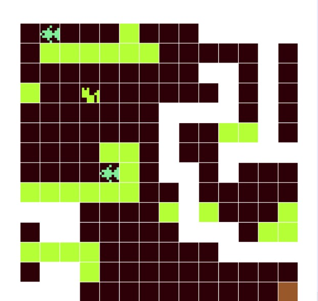
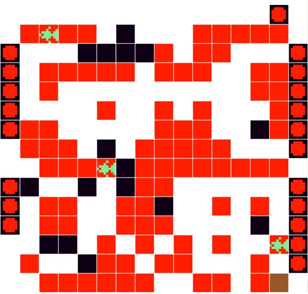
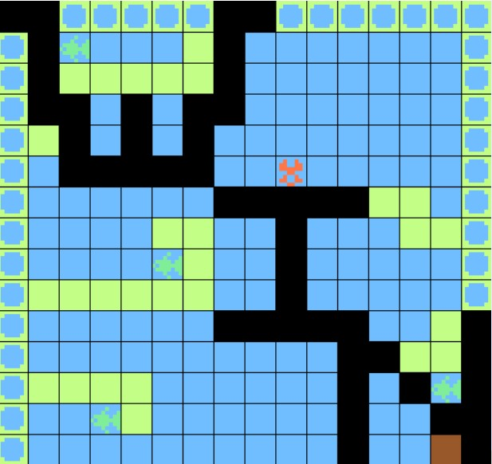

# Weekly Class Journal

## My Notes for class 2 ( Make a Thing ) : (01/22/2027)

**My First Game in Bitsy (A Painful Yet Rewarding Experience)**

When I first heard about Bitsy, I assumed it would be a smooth experience with a minimal learning curve. I thought I could just be creative and instantly create a game. However, I completely misjudged it.

**Game: Meow Rush**  
**What It's About:** A cat tries to collect treats and escape from a cruel dog before it gets caught and reported to its owner.

**Challenges (Not Just One, Haha)**  
Even though my game was fairly basic, I thought, "Why not add a lot of hurdles to make it more challenging for players?" Unfortunately, this ended up becoming a hurdle for me instead.

Bitsy is a small engine, not designed for games with many dynamic reactions. Creating an enemy that follows my player was an absolute nightmare. The breakthrough came when I realized that I needed to use hacks for these types of interactions. Thanks to Borsky, I could add built-in hacks and even integrate JavaScript for additional features. However, using hacks can come with glitches, so be warned!

Here’s the link to that fantastic website for you to check out: [Borsky](http://andrewyolland.com/borksy/). Thanks to Andrew, I was able to create my game! 
Along with this the tutroials by [DanCox](https://youtube.com/playlist?list=PLlXuD3kyVEr5sF4iM2CszNt-fSVZDqxUm&si=EuI6v0pqoVQdmq7Y) also helped me to grasp some of the basics of Bitsy .

**Moving on to My Initial Expectations:**  
When I say complicated, I mean the following features I intended to include:
- An enemy that follows my cat
- A stopwatch to increase pressure and difficulty
- Multiple secret rooms (I created one, including secret portals to the same room)
- Blackouts (I ultimately decided against this, as it would make my players too anxious)
- Color-coded dialogues

**One Major Reflection:** It’s okay to leave some things behind, even though it's disappointing. I may not be a pro at time management, but I can easily focus on what matters, so from the above ideas, I opted to concentrate on the main elements.

**Back to My Challenges:**  
In the last class, when Professor Matt discussed a peer’s journal, I noticed a paragraph where the person explained why they chose Pico-8: the color selector  in Bitsy is extremely frustrating.

A lot of changes had to be made in the game data just to manipulate the code. This is all about the challenges; now let’s focus on what we were able to achieve: a two-level game with increasing complexity. 
The first level is designed so that the cat needs to collect all four treats before unlocking the door, but there are invisible portals to a mystery room. One drawback of the game is that the dog follows the cat, but the game-over screen only appears if the cat collides with the dog. In the second level, the cat is met by two aggressive dogs. I think the speed at which the dogs chase is extremely fast, making it very hard to complete this level, but I might change it later.

Here are a couple of screenshots of the levels of my game (Will add soon , some path errors!)

## Design Journal Entry: 1 (01/29/2026)

Today, I had the time to continue my experimentation in Unity. I had forgotten a couple of basic concepts, but with the help of YouTube videos, documentation, and buddy ChatGPT, I quickly refreshed my memory on those. Firstly, I realized that I had not set up the project correctly, so I fixed that before diving into experimentation. I wanted to start with a couple of essential tasks, such as player movements and collisions, before moving on to other aspects. I set up the scene, added the sprites, and began writing the script. 

However, when I tried to test whether the script was working, I encountered an issue; it wasn't a bug in the code. Instead, it was a project setting that was preventing me from using the old input handling package that Unity usually employs. Since I followed my professor Matt's code, which utilized the old input handling, the solution was simple: I went to Project Settings > Other Settings > Active Input Handling and changed it to "Both." After saving and restarting, my basket started moving smoothly!

Here’s what I experimented with: first, I accomplished basic left and right movement, which, as I mentioned, took me quite a bit of time. Next, I wanted to add a ball that would collide with the basket and fall to the ground. I realized that if there was no ground (i.e., no collider on an empty game object), the ball would just keep falling into the abyss. Another oversight was with the ball's Rigidbody; I had not changed the gravity scale, which was set to 0. I kept rerunning the scene, but the ball never appeared. To achieve realistic gravity within the game, I set its value to 1 you can experiment with it for different effects!

Once I got these elements working, the fun part began: I wanted the color of the ball to change and for balls of varying sizes to fall. This feature worked as well; I created three circles tagged differently and used the compare tag technique. It worked well! I also added a small UI element to update the score, making it feel more lively.

### Key Takeaways
The world of Unity is vast. Many useful features are unknown, and some leave you questioning their existence. However, while rummaging through documentation and videos and facing various problems, I learned to use the features much more confidently.

### What I Want to Try / Experiment Next
I want to experiment with adding sound and make the game more enjoyable by introducing challenges. Additionally, I want to explore the idea of making it multiplayer. Let me give you a peek at what I had experimented with xd!

https://github.com/user-attachments/assets/b1fe4425-088c-44bc-9ac1-ad2d38e4c4b0

## Design Journal Entry 2 : (02/05/2026)

I spent the week brainstorming ideas on how to make Pawng more interesting. I also considered what features I could add to enhance the gameplay for players. I've created a mind map and done some low-fidelity prototyping for these potential features and additions. Unfortunately, I couldn't easily embed the PDF of my mind map, so you'll need to click the link to access it and review my thoughts. I kept the design simple and open to my imagination, without worrying too much about whether similar concepts already exist. Additionally, I started experimenting a bit with the Pawng code provided by Professor Matt. I won't be typing much today, as the PDF contains all my ideas from this past weekend!

### What I learned 
I have come to appreciate prototyping more. It helped me structure and reconsider a lot of things at the same time i got a pretty good idea on what I would really want to work on and what is possible given the time frame. 

### Future Plans 
My plan is pretty simple. I want to at least try to implement 2 -3 ideas that I brainstormed. Maybe by next week i will have a working prototype as well.

Here are my ideas -->[Pawng Ideas](https://drive.google.com/file/d/17YiSY06i48bGyKBMxmCPviE8eo_LLX1o/view?usp=drive_link)

 
