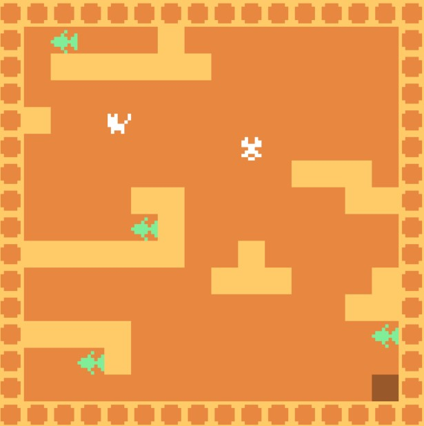
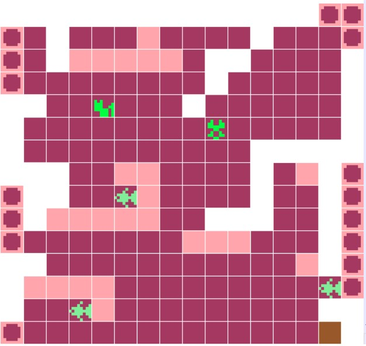
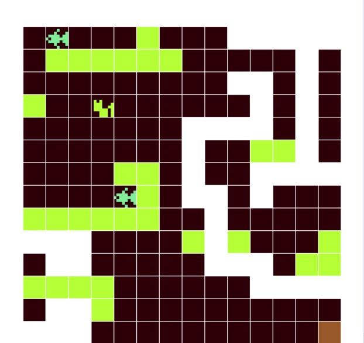
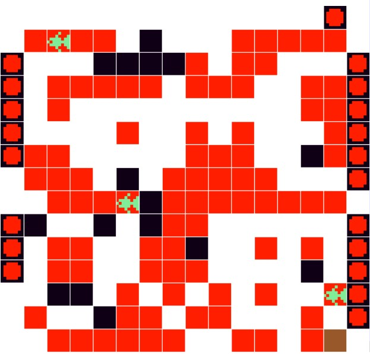
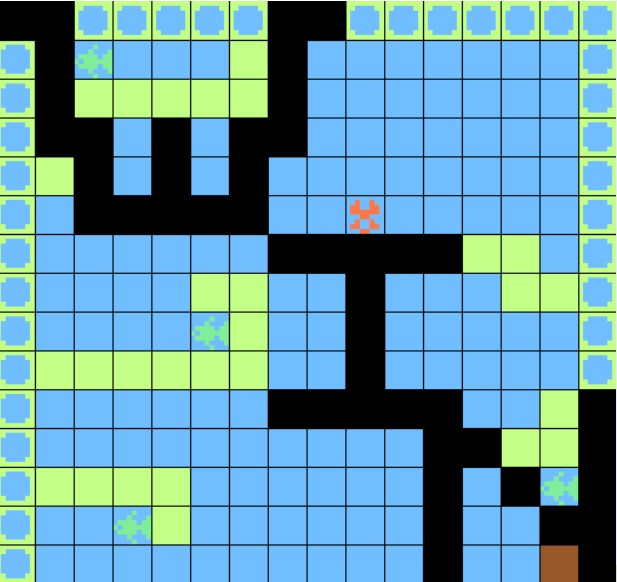

# Weekly Class Journal

## My Notes for class 2 ( Make a Thing ) : (01/22/2026)

**My First Game in Bitsy (A Painful Yet Rewarding Experience)**

When I first heard about Bitsy, I assumed it would be a smooth experience with a minimal learning curve. I thought I could just be creative and instantly create a game. However, I completely misjudged it.

**Game: Meow Rush**  
**What It's About:** A cat tries to collect treats and escape from a cruel dog before it gets caught and reported to its owner.

**Challenges (Not Just One, Haha)**  
Even though my game was fairly basic, I thought, "Why not add a lot of hurdles to make it more challenging for players?" Unfortunately, this ended up becoming a hurdle for me instead.

Bitsy is a small engine, not designed for games with many dynamic reactions. Creating an enemy that follows my player was an absolute nightmare. The breakthrough came when I realized that I needed to use hacks for these types of interactions. Thanks to Borsky, I could add built-in hacks and even integrate JavaScript for additional features. However, using hacks can come with glitches, so be warned!

Here’s the link to that fantastic website for you to check out: [Borsky](http://andrewyolland.com/borksy/). Thanks to Andrew, I was able to create my game! 
Along with this the tutroials by [DanCox](https://youtube.com/playlist?list=PLlXuD3kyVEr5sF4iM2CszNt-fSVZDqxUm&si=EuI6v0pqoVQdmq7Y) also helped me to grasp some of the basics of Bitsy .

**Moving on to My Initial Expectations:**  
When I say complicated, I mean the following features I intended to include:
- An enemy that follows my cat
- A stopwatch to increase pressure and difficulty
- Multiple secret rooms (I created one, including secret portals to the same room)
- Blackouts (I ultimately decided against this, as it would make my players too anxious)
- Color-coded dialogues

**One Major Reflection:** It’s okay to leave some things behind, even though it's disappointing. I may not be a pro at time management, but I can easily focus on what matters, so from the above ideas, I opted to concentrate on the main elements.

**Back to My Challenges:**  
In the last class, when Professor Matt discussed a peer’s journal, I noticed a paragraph where the person explained why they chose Pico-8: the color selector  in Bitsy is extremely frustrating.

A lot of changes had to be made in the game data just to manipulate the code. This is all about the challenges; now let’s focus on what we were able to achieve: a two-level game with increasing complexity. 
The first level is designed so that the cat needs to collect all four treats before unlocking the door, but there are invisible portals to a mystery room. One drawback of the game is that the dog follows the cat, but the game-over screen only appears if the cat collides with the dog. In the second level, the cat is met by two aggressive dogs. I think the speed at which the dogs chase is extremely fast, making it very hard to complete this level, but I might change it later.

Here are a couple of screenshots of the levels of my game (Will add soon , some path errors!)

## Design Journal Entry: 1 (01/29/2026)

Today, I had the time to continue my experimentation in Unity. I had forgotten a couple of basic concepts, but with the help of YouTube videos, documentation, and buddy ChatGPT, I quickly refreshed my memory on those. Firstly, I realized that I had not set up the project correctly, so I fixed that before diving into experimentation. I wanted to start with a couple of essential tasks, such as player movements and collisions, before moving on to other aspects. I set up the scene, added the sprites, and began writing the script. 

However, when I tried to test whether the script was working, I encountered an issue; it wasn't a bug in the code. Instead, it was a project setting that was preventing me from using the old input handling package that Unity usually employs. Since I followed my professor Matt's code, which utilized the old input handling, the solution was simple: I went to Project Settings > Other Settings > Active Input Handling and changed it to "Both." After saving and restarting, my basket started moving smoothly!

Here’s what I experimented with: first, I accomplished basic left and right movement, which, as I mentioned, took me quite a bit of time. Next, I wanted to add a ball that would collide with the basket and fall to the ground. I realized that if there was no ground (i.e., no collider on an empty game object), the ball would just keep falling into the abyss. Another oversight was with the ball's Rigidbody; I had not changed the gravity scale, which was set to 0. I kept rerunning the scene, but the ball never appeared. To achieve realistic gravity within the game, I set its value to 1 you can experiment with it for different effects!

Once I got these elements working, the fun part began: I wanted the color of the ball to change and for balls of varying sizes to fall. This feature worked as well; I created three circles tagged differently and used the compare tag technique. It worked well! I also added a small UI element to update the score, making it feel more lively.

### Key Takeaways
The world of Unity is vast. Many useful features are unknown, and some leave you questioning their existence. However, while rummaging through documentation and videos and facing various problems, I learned to use the features much more confidently.

### What I Want to Try / Experiment Next
I want to experiment with adding sound and make the game more enjoyable by introducing challenges. Additionally, I want to explore the idea of making it multiplayer. Let me give you a peek at what I had experimented with xd!

https://github.com/user-attachments/assets/b1fe4425-088c-44bc-9ac1-ad2d38e4c4b0

## Design Journal Entry 2 : (02/05/2026)

I spent the week brainstorming ideas on how to make Pawng more interesting. I also considered what features I could add to enhance the gameplay for players. I've created a mind map and done some low-fidelity prototyping for these potential features and additions. Unfortunately, I couldn't easily embed the PDF of my mind map, so you'll need to click the link to access it and review my thoughts. I kept the design simple and open to my imagination, without worrying too much about whether similar concepts already exist. Additionally, I started experimenting a bit with the Pawng code provided by Professor Matt. I won't be typing much today, as the PDF contains all my ideas from this past weekend!

### What I learned 
I have come to appreciate prototyping more. It helped me structure and reconsider a lot of things at the same time i got a pretty good idea on what I would really want to work on and what is possible given the time frame. 

### Future Plans 
My plan is pretty simple. I want to at least try to implement 2 -3 ideas that I brainstormed. Maybe by next week i will have a working prototype as well.

Here are my ideas -->[Pawng Ideas](https://drive.google.com/file/d/17YiSY06i48bGyKBMxmCPviE8eo_LLX1o/view?usp=drive_link)

## Design Journal Entry 3 : (02/12/2026)
This weekend, my main goal is to take my time, get more familiar with Unity and C#, and do some experimenting. Last class, I worked on a prototype called "BreakinWall," which might not be the correct title, but it has similar mechanics to my previous project, "Pawng." In BreakinWall, the goal isn’t to bounce a ball between paddles; instead, the aim is to hit bricks and prevent the ball from falling into the abyss.

I came up with a couple of game features for Pawng that i worked on last week (Check out the Pawng.pdf). Rather than using the template given by Professor Matt, I decided to build a simpler version of Pong. Last time, I focused on the UI, but this time I aimed to work on the following:

1. Make the paddles move.
2. Make the ball collide with the paddles.
3. Add a sound effect when the ball collides with a paddle.
4. Change the size of the ball at regular intervals.
5. Implement a scene transition to a Game Over screen when the ball misses the paddle and goes out of bounds.

### What I Learned

When I first started, I initially used an old-school approach for paddle movement by utilizing GetAxis for vertical movement. I quickly realized that was a mistake (too much work , then add additional code for the individual movement of the paddle) and that I should use Input.GetKey instead. This gives me the ability to control the object with the same functionality but allows for different key inputs. 

Another mistake I made was related to making the ball bounce. I added a Physics Material instead of the correct Physics Material2D, which cost me some time. Despite these challenges, I completed four out of the five features I aimed for. I learned to be patient when I get stuck because frustration only leads to more mistakes.

### Future Plan

I wasn't able to add all the features I had planned, so I would like to continue working on them until I reach my goal of implementing at least two or three more features in this simple Pong game. That’s all from me for today! Let me share a short clip of what I worked on!

https://github.com/user-attachments/assets/e754b2b4-b8e1-402b-8f0f-9b639cfe8be7

## Design Journal Entry 4: (02/19/2026)

Today, I continued my exploration and implemented a couple of features I had brainstormed. It seems like I'm following a plan, and with each passing week, I'm making progress. However, I think I might work on this for one more week to add the UI and score manager and fix a couple of issues. After that, I might want to explore or implement a game idea I have in mind. It's not something very big; it's more small and simple. I'd like to create a dialogue-based game, but we will see. After today's class and the extra credit game analysis, I believe I will have a clearer idea.

Now, let's continue with what I worked on today. To be honest, today was not the best in terms of coding! There was a lot of debugging, and the most frustrating part was that most of these issues were not logic errors. I simply forgot to attach the prefab or mistakenly attached scripts to the wrong components.

### Main Aim and Sharing My Mistakes

I wanted to work on the transition to the Game Over scene, which I couldn't accomplish last time, along with the multiplier features. I worked on two multipliers: OneX for increasing the size of the paddle by a certain offset and TwoX for increasing the number of balls. Additionally, I decided to create some pixel art and make PNGs for the multipliers.

Let me walk you through it:

1. The transition to another scene was simple, and I didn't spend much time on it. (But always remember, Future Nisma: when you want to transition to another scene, make sure it's included in the scene list. In Unity, go to File > Build Settings > Scenes In Build > Drag and drop your scene in there.) However, the multipliers took a hefty amount of my time. 

   The idea was to create a spawner that could spawn these two multipliers at random locations within the main camera view. The other task was to write the scripts for the power-ups/multipliers to perform their specific functions. 

   Once I finished coding and pressed play in Unity, the ball, for some reason, did not trigger anything when it collided with the multipliers. Before you ask if I added the Collider2D, enabled the isTrigger, or if the ball had a Rigidbody, let me tell you that the first mistake I found was that I had named the method "OnTriggerEnter2D" as "On**Triggered**Enter2D" (with "triggered" instead of "trigger"). Hmmm.

   After fixing that, nothing changed, so I realized that there was indeed another problem. After burning a decent amount of time, I discovered that I hadn't attached the scripts of the multipliers to the prefab; instead, I attached them to a specific instance of the prefab, or you could say a single copy. So now the spawner was spawning the multipliers from a prefab that did not have any script attached to it, plus no collider. These were a couple of major mistakes I made.
Following is the fast pixel art i did on the go .

### What I Learned

I learned to be more patient with this process. It's not always about getting something polished or perfect. Often, we don't continue with our ideas simply because we fear they won't meet people's expectations. However, I have realized that we should take steps forward, whether we have a simple idea, a big idea, or no idea at all. We should start and not wait for the perfect setting. This game prototyping class is making me feel that way. I'm happy that I'm trying to create things, even if they are basic. What matters is that I am consistent.

### Future Plans

I would like to dedicate one more week to this project, if possible, and try to add one more feature. Since I enjoy using colors and the current palette is a bit dull, I will probably enhance that. Additionally, creating a basic UI for tracking the score, timer, and life streak would be nice. After that, I want to explore a different genre of game, perhaps my own idea. We'll see! 

For now, I have a couple of videos to share about my progress. (the first one is more focused on the ball multiplier/ Onex and second video is more focused on the Twox/paddle growth)

https://github.com/user-attachments/assets/813ddf8e-c314-40e6-8e6b-1fac4f1edfb4

https://github.com/user-attachments/assets/b8627dda-cde4-484c-b7f6-7a01d86d51c9

## Design Journal Entry 5 : (02/23/2026)
The last class was really fun. Initially, I didn't know what to expect from an Ideation Workshop with my peers. Most of the time, my process of brainstorming ideas involves sitting alone and writing my thoughts down on paper without considering the details. When I brainstorm, I keep all my options open without worrying about "how can I implement this?" In the past, when I had ideas, my mind would start thinking about other complexities, and I would instantly discard the idea. However, I have changed my workflow. We cannot predict the success of an idea, but it's worth noting down every single one of them. Sometimes it's nice to review where we started: what the initial idea was, how it evolved, and what major forces led to the change. Now, I can see what it has become.

The Ideation Workshop introduced me to a new way of mixing and matching ideas. I never thought it could be this fun! The part of the workshop where we had to pair up with someone and each choose a word from our list of potential ideas generated a plethora of thoughts in my mind. The best part was that two brains were coming up with ideas some strange, some fun, and some strategy-based. The three rounds of that activity bombarded my brain with so many ideas that it was hard to keep track of them, so I kept noting down parts of those ideas. Ideation is a spontaneous process,  an idea can easily be lost if not stored somewhere.

To give you a sneak peek into my list, within those five minutes, I noted down a couple of words and phrases (I might have misunderstood some, but regardless, it was worth it). Next, I can jump into my top three ideas that I was excited about.

https://github.com/user-attachments/assets/e8283ee6-02f1-4b93-af8a-74bd4bf80020

### THE TOP 3 IDEAS

Instrument + Spices
Crazy + Zombie
Suburban + Meat 

### Instrument + Spices
This combination of words sparked a fantastic idea in my partner's and my mind. The idea was to create a rhythm game that also incorporates the concept of spices by allowing players to create delicious dishes through correct note sequences. I even have a name for this game: "Melodicious"! 

The concept is that in each round, players will need to play a melody, and if they play it correctly, they can collect ingredients. However, if they play a wrong or disturbing note, they will lose ingredients. Players do not have unlimited attempts, which adds an extra layer of challenge.

Essentially, it's a mix of piano tiles and a cooking game!

I created a prototype that I believe combines look and role prototyping, which would be categorized as low-fidelity prototyping. Here's a gof and to actual enjoy with audio watch the video XD!. The goal is simple to collect the number of ingredients mentioned (in the video we are trying to make a cheesecake) so collect all the ingredients make a delicious cheescake!!

**The Video with Audio**

https://github.com/user-attachments/assets/8f5b7819-2c7b-45f9-b1c5-029b45ea6e1a

### Prototyping Process Overview:

If you're curious about what I used for the prototype, here's a breakdown. For the sound and visuals, I utilized Strudel ([STRUDEL](https://strudel.cc/workshop/getting-started/)) and coded in some notes. Once that was complete, I screen recorded to capture about 27-30 seconds of footage. 

From there, I added quick game elements using a free video editing application on my tablet called "InShot." I then focused on fine-tuning the prototype to my liking. While I could have polished the prototype further, it was intended to be a quick version, so I didn't want to invest a lot of time in building low-fidelity prototypes. 

I believe that the real investment of time should come when you reach the stage of creating a functional prototype. That's when you can afford to spend more time and make it much more polished.

### Crazy + Zombie
This game follows two best friends, X and Y.

X used to be human and lived a normal, happy life. His only close friend was Y, someone he deeply cared about. The only issue was that Y has always been mentally unstable and unpredictable, though still a loyal and dear friend.

Then the Earth is hit by a zombie apocalypse.

Unfortunately, X becomes infected and turns into a zombie. However, unlike the others, he hasn’t completely lost his humanity. He still remembers who he is, and more importantly, he remembers Y. Inspired by the story Warm Bodies:[WARM BODIES](https://www.imdb.com/title/tt1588173/), X exists in a fragile state physically a zombie, but mentally still human.

Everyone else is gone.

Y is the only person X has left.

Now, X’s primary goal is to protect Y at all costs. But there’s a complication: Y’s unstable nature makes him unpredictable. He often forgets who X is, wanders into danger, or behaves irrationally. Because of this, X cannot simply guide him directly.

Instead, **the core gameplay revolves around indirect protection.**

**X manipulates the environment to keep Y safe. If Y walks toward danger, X creates obstacles to block his path. If enemies approach, X diverts them. If Y makes reckless decisions, X adjusts the surroundings to prevent disaster. The player does not control Y they protect him.**

Alongside this, X has another urgent mission to find an antidote before he completely loses his remaining humanity. As time passes, his human consciousness slowly fades. If he fails to find a cure in time, he risks losing both himself and the only friend he has left.

### Suburban + Meat: Game Concept
At first, this combination felt extremely strange but also fascinating. We initially started with a darker direction a family moves into a suburban house and discovers large amounts of meat stored in the basement. As my peer and I continued discussing it, the concept began drifting toward something very dark and gory. That wasn’t the feeling we wanted. We made a mutual decision to step away from explicit horror and instead aim for something more subtle — slightly mysterious, a bit eerie, but still cozy and playful in tone.
Then, while scrolling through Instagram reels, I came across a game called Creature Kitchen on Steam ([CREATURE KITCHEN](https://store.steampowered.com/app/3097300/Creature_Kitchen/) ) . The concept of that game inspired me. In it, creatures live inside the house. They are not trying to eat you  they are simply hungry but confused about what they like. As the homeowner, it becomes your responsibility to experiment with food, discover their preferences, and feed them. That idea shifted my thinking completely. **Instead of meat representing something violent, it could represent connection.**

A family moves to a new town. They purchase a large suburban house at a surprisingly low price. It feels like a lucky deal. But they don’t immediately realize something is wrong. When they explore the house and reach the basement, they discover something shocking: multiple industrial freezers filled with large quantities of meat. Different varieties beef, mutton, minced meat, chops arecarefully stored and organized. The amount is overwhelming. They are confused and disturbed. Why would the previous homeowner leave this behind?

They attempt to contact him, but he is unreachable. At the same time, the town’s atmosphere feels off. The neighbors seem distant. There’s visible distrust and unhappiness in their eyes. Conversations feel cold. The family senses they are not welcome. What they don’t know is something far more serious: The previous homeowner had secretly signed a contract with a local town committee to demolish the house. The sale was rushed. The demolition was planned. The neighbors are aware of this agreement. The family has unknowingly walked into a situation where their home might not even be permanent.
**Time is limited.**

Seeing the distrust in the neighbor's eyes and realizing they are running out of time, the family understands they need to integrate into the community quickly. They need to change how the town sees them. They remember “food is the gateway to love” And suddenly, the basement full of meat becomes an opportunity instead of a threat.

### Future Plan
After the ideation workshop, as you can see, my mind is buzzing with ideas. I am considering to start working on a specific idea and seeing it through to completion (plan is to  keep the scope small and achievable HOPEFULLY!!). This idea may be inspired by the concepts discussed earlier or could be something entirely new. I have yet to decide. I plan to use my reading week to finalize and determine what I actually want to pursue. Till then take care xd!

